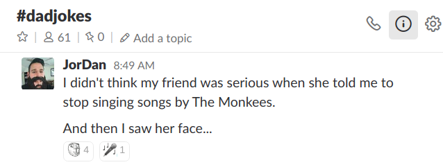

title: Many Small Components
class: animation-fade center middle
layout: true

<!-- This slide will serve as the base layout for all your slides -->

.twitter[
@jesstelford
]

---

class: impact

# {{title}}

## @ Domain.com.au

### [msc-sydjs.now.sh](https://msc-sydjs.now.sh)

---

class: impact

# Hi


---

class: impact

# Jess Telford

# <a href="http://twitter.com/jesstelford" class="nolink">@jesstelford</a>

???

- My creds
- Full stack
- Frontend only for 6yrs
- Domain for 3yrs

Dad joke channel:

---

class: impact


???

- Feeling lyrical today:
- My friend told me to stop singing "Wonderwall" by Oasis
- 🎜 I said _maybeeeee_...

---

class: impact

# {{title}}

## @ Domain.com.au

### [msc-sydjs.now.sh](https://msc-sydjs.now.sh)

???

- Evolution of FE at Domain over 3yrs
- 9 Lessons:
  - Tooling
  - Processes
  - Styling
  - Theming
  - Server Side Rendering
- This is Onboarding

---


???

- What is Domain.com.au?
- Growth
- Over 35 FE devs

---

class: flex-slide flex-column

# c. 2015

.big[
- Homepage
- Search results
- Property details
- ... plus others
]

???

- A few core pages
- Great BE
- microservices: lots of effort
- FE: 1 person, not well designed

---

# `main.css`
# &nbsp;
# &nbsp;
# `main.js`

???

- Everything shared
- Single bundle
- Manual build / concat
- Outgrowing initial decisions
- Bug whack-a-mole (image gallery)

---

# `common.css`
# &nbsp;
# &nbsp;
# `main.js`

???

- The fix
- Extract base styles

---

# `common.css`
# `search-page.css`
# `property-details.css`
# `main.js`

???

- But: dupe on page 1/2/3/etc
- Differences creep in
- Fix after the fact
- Outgrew this choice too
- Added some tools to help build

---

class: lesson impact

# Lesson #1

## Don't leave frontend till last

???

- Evolution over 6mo? 2yr? 5yr?
- Can it grow?
- Ours couldn't.
- Copy+Paste doesn't scale
  - Bug in gallery? Fix multiple times
  - Tech debt is exponential

---


???

- Domain growing
- HPG / CRE
- Price Finder end 2013
- AllHomes mid 2014
- MyDesktop
- Unified UX & Design

---


## How do we scale Frontend?

???

- _Pause_
- Design + UX thinking same
- Lots of research
- Not many folks talking

---


---

> we can break entire interfaces down into .alt[**fundamental building blocks**] and work
> up from there.

.attribution[Brad Frost]

???

- Instantly clicked with me
- Design / UX + FE agree

---


???

- Atoms, Molecules, Organisms, Templates, Pages
- Blocks that can be put together
- Defined our FE strategy

---

### Atoms


[.attribution[Atomic Design]](http://bradfrost.com/blog/post/atomic-web-design/)

---

### Molecule


[.attribution[Atomic Design]](http://bradfrost.com/blog/post/atomic-web-design/)

---

### Organism


[.attribution[Atomic Design]](http://bradfrost.com/blog/post/atomic-web-design/)

???

- Good strategy

---

class: lesson impact

# Lesson #2

## Your Frontend strategy is more than tools & code

???

- Design, UX, backend
- buy-in makes it easier
- _Pause_

---


???

- Challenge: Practical application in code?
- Q: Boundaries?
- Eg: Button with an Icon + text
- Theming?

---

> Will it be reused?

.attribution[Me. Most days.]

???

- Rule: Everything as simple as logical.
- Boundaries case-by-case
- Called "Components"

---

class: lesson impact

# Lesson #3


## Everything is a component

???

- ✓ Strategy
- ✓ Aligned to Design / UX
- I Nerded out over possibilities
- Start somewhere small

---


???

- Region search
  - Select state
  - populates list
  - select boxes
  - search
- Needed to be built anyway
- Spend a little extra time

---


???

- But first, what tech?

---


---


???

- Investigation
- Stable? Support? Match our strategy?
- Angular: Popular, No small blocks
- Ember: DX++, no small blocks
- Polymer: Small blocks, No browser support
- React: ✓✓✓
  - \+ SSR & existing components!

---


???

- Built it
- Great? No.
- Lots of learning
- Wasn't thinking in components

---

>  Why this framework was able to be successful at Facebook: We didn't have to
>  convert everything, we could .alt[**use it kind of piecemeal**].

.attribution[Tom Occhino]

???

- Didn't realize till too late
- Piecemeal + Fundamental building blocks == success
- Iterative

---

class: lesson impact

# Lesson #4

## Build it to be replaceable

???

- Not "Build to throw away"
  - Implies less effort
- Quality is important
- Boundaries are important
- Components have clear boundaries

---

# Tooling

???

- So far:
  - Frontend Strategy
  - Picked our tech (React)
  - Built a project
  - We're focused on tooling
- FB's motto?

---

> Move fast .alt[**with stable infrastructure**]

[.attribution[Facebook]](http://mashable.com/2014/04/30/facebooks-new-mantra-move-fast-with-stability/#yXFxrbsX9PqN)

???

- Not "break things"
- Tooling enables this
  - Infrastructure
  - Building
  - Testing, etc
- API contracts, etc
- Automate all the things
- Lesson #3 "Everything Component"
  - Tools for "Components"?

---

## Components


???

- Basic flow
- Component used inside another project
- Private `npm`

- Automate as much as possible
- Best practice: one, easy command
  - Eg: `create-react-app` / `ember-cli`

---

## Components


???

- Look inside a component

---

.no-margin.large.code-center[
```
├── package.json
├── README.md
├── src
│   ├── js
│   ├── sass
│   └── static
└── test
```
]

???

- Standard layout

---

class: flex-slide

.no-margin.large.code-center[
```
├── package.json
├── README.md
*├── src
*│   ├── js
│   ├── sass
│   └── static
└── test
```
]

???

- Look at `src/js`

--

.no-margin.big.code-center[
```
*src/js
  ↓
eslint
  ↓
babel
  ↓
lib/js
```
]

???

- `eslint` for styling errors + gotchyas
- `babel` to convert to supported JS
- `lib/js/` published to `npm`

---

class: flex-slide

.no-margin.large.code-center[
```
├── package.json
├── README.md
├── src
│   ├── js
│   ├── sass
│   └── static
*├── lib
*│   └── js
└── test
```
]

.no-margin.big.code-center[
```
src/js
  ↓
eslint
  ↓
babel
  ↓
*lib/js
```
]

???

- Added `lib/js/`
- Eg: `lib/js/index.js`

---

class: flex-slide

.no-margin.large.code-center[
```
*├── package.json
├── README.md
├── src
│   ├── js
│   ├── sass
│   └── static
├── lib
│   └── js
└── test
```
]


.large.no-margin.code-center[
```json
{
  "name": "foobar",
  "main": "lib/js/index.js",
  ...
}
```
]

???

- When `npm install`'d, will find correct file

---

class: flex-slide

.no-margin.large.code-center[
```
├── package.json
├── README.md
├── src
│   ├── js
│   ├── sass
│   └── static
├── lib
│   └── js
└── test
```
]

.no-margin.big.code-center[
```
*src/js
* ↓
*eslint
* ↓
*babel
  ↓
lib/js
```
]

???

- Lots of steps
- Can we automate?
- Assumptions (directory locations)

---

class: flex-slide

.no-margin.large.code-center[
```
├── package.json
├── README.md
├── src
│   ├── js
│   ├── sass
│   └── static
├── lib
│   └── js
└── test
```
]

.no-margin.big.code-center[
```
*fe-build
   ↓
 lib/js
```
]

???

- `fe-build` codifies it all

---

class: flex-slide

.no-margin.large.code-center[
```
*├── package.json
├── README.md
├── src
│   ├── js
│   ├── sass
│   └── static
├── lib
│   └── js
└── test
```
]

.large.no-margin.code-center[
```json
{
  "name": "foobar",
  "main": "lib/js/index.js",
* "scripts": {
*   "build": "fe-build"
* }
  ...
}
```

```bash
$ npm run build
```
]

???

- `fe-build`
  - Over 200 private packages!

---

class: flex-slide

.no-margin.large.code-center[
```
├── package.json
├── README.md
*├── src
*│   ├── js    ✓
│   ├── sass
│   └── static
├── lib
│   └── js
└── test
```
]

???

- That's `src/js/` done

---

class: flex-slide

.no-margin.large.code-center[
```
├── package.json
├── README.md
*├── src
│   ├── js
*│   ├── sass
│   └── static
├── lib
│   └── js
└── test
```
]

???

- How do we build SASS?
- Like JS?

--

.no-margin.big.code-center[
```
*src/sass
    ↓
scss_lint
    ↓
   sass
    ↓
lib/css
```
]

???

- Like JS
- `lib/css/` published to `npm`

---

class: flex-slide

.no-margin.large.code-center[
```
├── package.json
├── README.md
├── src
│   ├── js
│   ├── sass
│   └── static
*├── lib
*│   ├── css
│   └── js
└── test
```
]

.no-margin.big.code-center[
```
src/sass
    ↓
scss_lint
    ↓
   sass
    ↓
*lib/css 
```
]

???

- But, a problem!

---

class: flex-slide

.no-margin.large.code-center[
```
*├── package.json
├── README.md
├── src
│   ├── js
│   ├── sass
│   └── static
├── lib
│   ├── css
│   └── js
└── test
```
]

.large.no-margin.code-center[
```json
{
  "name": "foobar",
  "main": "lib/js/index.js",
* "??": "lib/css/styles.css",
  "scripts": {
    "build": "fe-build"
  }
  ...
}
```
]

???

- No way to compose css
- no standard for "main" field

---

.no-margin.big.code-center[
```bash
$ npm install foobar
```
]

.no-margin.big.code-center[
```
├── package.json
├── node_modules
│   └── foobar
│       └── lib
│           └── css
└── src
    └── sass
```
]

???

- Another problem
- Combine sass variables?

---

class: force-top

.large.no-margin[
```scss
// foobar/src/sass/styles.scss
.foo__button {
  color: $text-colour;
}
```
]

???

- Regular sass variable
- Parent can overwrite the value

--

.large.no-margin.space-top[
```scss
// src/sass/styles.scss
$text-colour: #fff;
@import 'node_modules/foobar/lib/css/styles.css';
```
]

???

- Remember: Compiled sass -> css

--

.large.no-margin.space-top[
```scss
// node_modules/foobar/lib/css/styles.css
.foo__button {
  color: ???;
}
```
]

???

- What's the value?
- An error?
- Fallback?
- Parent can't overwrite

---


---

class: flex-slide

.no-margin.large.code-center[
```
├── package.json
├── README.md
├── src
│   ├── js
│   ├── sass
│   └── static
├── lib
*│   ├── css
│   └── js
└── test
```
]

.no-margin.big.code-center[
```
 src/sass
    ↓
scss_lint
    ↓
*  sass
*   ↓
*lib/css
```
]

???

- Instead of this

---

class: flex-slide

.no-margin.large.code-center[
```
├── package.json
├── README.md
├── src
│   ├── js
│   ├── sass
│   └── static
├── lib
*│   ├── sass
│   └── js
└── test
```
]

.no-margin.big.code-center[
```
 src/sass
    ↓
scss_lint
    ↓
*   cp
*   ↓
*lib/sass
```
]

???

- Get this

---

.no-margin.big.code-center[
```
├── package.json
├── node_modules
│   └── foobar
│       └── lib
*│           └── css 
└── src
    └── sass
```
]

???

- Instead of this

---

.no-margin.big.code-center[
```
├── package.json
├── node_modules
│   └── foobar
│       └── lib
*│           └── sass
└── src
    └── sass
```
]

???

- Get this

---

.large.no-margin[
```json
// package.json
{
  "name": "foobar",
  "main": "lib/js/index.js",
  "scripts": {
    "build": "fe-build",
*   "build:sass": "cp -r src/sass lib/sass"
  }
  ...
}
```
]

???

- Combine into one `fe-build` command

---

.large.no-margin[
```json
// package.json
{
  "name": "foobar",
  "main": "lib/js/index.js",
  "scripts": {
*   "build": "fe-build"
  }
  ...

}
```
]

???

- Codified another assumption

---

.large.no-margin[
```scss
$text-colour: #fff;
@import 'node_modules/foobar/lib/sass/styles.scss
```
]

.row[
.col-9.large[
&nbsp;

&nbsp;

&nbsp;

&nbsp;
]
]

???

- Our code example again:

---

.large.no-margin[
```scss
*$text-colour: #fff;
@import 'node_modules/foobar/lib/sass/styles.scss
```
]

.row[
.col-9.large.no-margin.space-top[
```scss
.foo__button {
* color: #fff;
}
```
]

.col-3[

]
]

???

- Now variables work

---

class: flex-slide flex-column

## Theming

???

- Why sass variables?
- Theming is hard
- Lots of Domain brands

--


???

- Eg: 2 items the same

---

.large.no-margin.code-center[
```scss
.auction-results__container {
  background-color: $c-primary;
}

.auction-results__stats {
  color: $c-secondary;
}

.auction-reuslts__separator {
  border-color: $c-neutral;
}
```
]

---

.large.no-margin.code-center[
```scss
// theme-domain.scss
$c-primary: #0b2047 !default;
$c-secondary: #0ea800 !default;
$c-neutral: #7e8594 !default;
```
]

.large.no-margin.code-center.space-top[
```scss
// theme-allhomes.scss
$c-primary: #fff !default;
$c-secondary: #0063e6 !default;
$c-neutral: #7e8594 !default;
```
]

???

- Only `secondary` diff
- In library `fe-brary`

---

.big[.large[`fe-build --theme domain`]]

.big[↓]

.no-margin.large.code-center[
```scss
@import 'fe-brary/themes/theme-domain.scss'
@import './src/sass/styles.scss'
```
]

???

- Constructs this entry point
- not in `package.json` (done in SSR)

---

class: lesson impact

# Lesson #5

## Plan your theming

.large[_(Only if you have to)_]

---

### Automated during publish


???

- When to do this?

---

.large.no-margin[
```json
// package.json
{
  "name": "foobar",
  "main": "lib/js/index.js",
  "scripts": {
*   "build": "fe-build"
  }
  ...

}
```
]

???

- Not really 'build'

---

.large.no-margin[
```json
// package.json
{
  "name": "foobar",
  "main": "lib/js/index.js",
  "scripts": {
*   "prepublish": "fe-build"
  }
  ...

}
```
]

???

- Just before publishing to npm

---

class: lesson impact

# Lesson #6

## Tooling is important

???

- Manual sucks
  - Building
  - Linting
  - Testing
  - new servers
  - boilerplates
  - etc
Joke:

---

class: lesson impact

???

- I thought my friend wasn't serious when she said "Stop singing songs by The
Monkees"
- 🎜 And then I saw her face...

---

class: impact




---

class: flex-slide

.no-margin.large.code-center[
```
├── package.json
├── README.md
├── src
│   ├── js
│   ├── sass
│   └── static
├── lib
│   ├── css
│   └── js
└── test
```
]

.large.no-margin[
```json
// package.json
{
  "name": "foobar",
  "main": "lib/js/index.js",
  "scripts": {
    "prepublish": "fe-build"
  }
  ...
}
```
]

???

- Assumptions
- Hard to setup
- not going to change
- Already codified cli options info `fe-build`

---

&nbsp;


[.big[yeoman.io]](http://yeoman.io/)

???

- Scaffolding tool

---

.no-margin.big.code-center[
```
$ mkdir foo
$ cd foo
*$ yo fe-boilerplate
```
]


[.big[yeoman.io]](http://yeoman.io/)

???

- Answer Q's
- Creates dirs
- fill `package.json`
- install deps
- Less thought necessary
- scales well

---

class: flex-slide

.no-margin.large.code-center[
```
├── package.json
├── README.md
├── src
│   ├── js
│   ├── sass
│   └── static
├── lib
│   ├── css
│   └── js
└── test
```
]

.large.no-margin[
```json
// package.json
{
  "name": "foobar",
  "main": "lib/js/index.js",
  "scripts": {
    "prepublish": "fe-build"
  }
  ...
}
```
]

???

- `yo` get this

- Quick review of where we're up to

---


???

- `yo` to create
- `npm publish`
- `npm install`

---

.no-margin.large[
```javascript
// src/js/index.js
const FooBar = require('foobar');
...
```
]

&nbsp;

.no-margin.large[
```scss
// src/sass/styles.scss
@import 'node_modules/foobar/lib/scss/styles.scss'
...
```
]

???

- hack hack hack
- `publish` + `install` infinitely

---


---

# How do we render a page?

???

- components === great
- not enough on own

---

class: impact

## Server Side Rendering

???

- Mentioned react SSR possible
- Necessary?
- debate

---

## SEO

???

- Important!
- Google runs JS
- Perf: TTFP

--

### ... _maybe?_

---

[.large[kryogenix.org/code/browser/everyonehasjs.html]](kryogenix.org/code/browser/everyonehasjs.html)


???

- Stuart Langridge
- Devs:
  - Fiber connection
  - MacBook Pro
- Users:
  - Flaky connection
  - Old laptop

---

## ✔ Server Side Rendering

???

Yes. Domain needs SSR

---

# React  SSR

--

.big[
`ReactDOMServer.renderToString()`
]

--

.big[
`React.NET`
]

--

.big[
`java`?
]

--

.big[
`perl`?
]

--


???

- Every stack different?
- Or like `fe-build` for BE?
  - Wrap each SSR impl?
  - node?
  - co-process? (devops nightmare)

---

class: lesson impact

# Lesson #7

## Think about Server Side Rendering

???

- Don't be handwavey
- We thought lots
- What's similar?

---


???

- We've done this before

--

## _Microservices_

---

## _Rendering As A Service_

???

- an API that returns HTML

---

class: lesson impact

# Lesson #8

## Re-use proven patterns

---


???

- "Renderer"
- S3 backing store
- Autoscale, etc
- How do we render a page?
  - Still unanswered
  - Server uses html returned
  - wraps in `<html>` tags, etc

---


???

- Client gets full doc
- Client fetches JS/CSS from S3
- Bigger picture?

---


???

- SSR on top
- `npm` part on bottom
- new part on right
  - the "glue"
  - "Bundler"

---


???

- Forget about service for now
- We'll come back to it

---


???

- Already talked about `npm publish`
- npm hook
- Automation FTW
- Saves output in S3

---

.no-margin.big.code-center[
```
styles.scss -> styles.css
index.js -> client.js
index.js -> server.js
foo.png -> foo_aa34f8.png
```
]

???

- guts of bundler

---

.no-margin.big.code-center[
```
*styles.scss -> styles.css
index.js -> client.js
index.js -> server.js
foo.png -> foo_aa34f8.png
```
]

???

- Earlier, removed sass
- This is where it's back

---

.no-margin.big.code-center[
```
styles.scss -> styles.css
*index.js -> client.js
index.js -> server.js
foo.png -> foo_aa34f8.png
```
]

???

- Webpack bundle output

---

.no-margin.big.code-center[
```
styles.scss -> styles.css
index.js -> client.js
*index.js -> server.js
foo.png -> foo_aa34f8.png
```
]

???

- The thing "renderer" executes
- SSR

---

.no-margin.large.code-center[
```javascript
import ReactDOMServer from 'react-dom/server'

module.exports = function render(props) {
  return ReactDOMServer.renderToString(...)
}
```
]

???

- Simplified
- props to service passed in here
- returns HTML

---

.no-margin.big.code-center[
```
styles.scss -> styles.css
index.js -> client.js
index.js -> server.js
*foo.png -> foo_aa34f8.png
```
]

???

- static assets
- fingerprint on file contents
- uploads to S3

---

.no-margin.large.code-center[
```html

```

.big[↓]

```html

```
]


???

- rewrites \*.js & \*.scss
- `foobar` is component name

---

.no-margin.big.code-center[
```
styles.scss -> styles.css
index.js -> client.js
index.js -> server.js
foo.png -> foo_aa34f8.png
```
]

???

- Main steps only
- Details? Ask after talk.

---


???

- `npm publish` triggers build
- build pushes into S3
- On other side of S3...

---


???

- Service fetches `server.js`
- Executes `server.js`
- Client fetches:
  - client.js / css
  - static assets

---


???

- Final walk through
- Split "bundle" / "render" good
- Devs can focus
  - FE on UI
  - BE make service calls
  - Ops keeping renderer running

---

## Live _now_

### 10,000 rpm
### 5ms

???

- averages
- Lots more to do!
- Last lesson...

---

class: lesson impact

# Lesson #9

## Iterate and Improve

???

- Iterating:
  - Browserify -> Webpack
  - Bundle splitting
  - SPA
  - CSS-in-JS
- Do once, works everywhere
  - Thanks to assumptions

---

## Lessons Learned @ Domain

.big.left.space-left[
.space-left[
1. Don't leave frontend till last
2. Your Frontend strategy is more than tools & code
3. Everything is a component
4. Build it to be replaceable
5. Plan your theming
6. Tooling is important
7. Think about Server Side Rendering
8. Re-use proven patterns
9. Iterate and Improve
]
]

???

Take away this one thing: [joke]

---

class: impact


???

- At any given time, the urge to sing "The Lion Sleeps Tonight" is just a whim
  away
- 🎜 a-whim-away a-whim-away a-whim-awy a-woo-oooooo-ooOOooo

---

class: impact

<h1 style="margin: 1.7em 0">fin.</h1>

[.attribution[Emoji by Twitter / CC BY 4.0 ]](https://github.com/twitter/twemoji)
